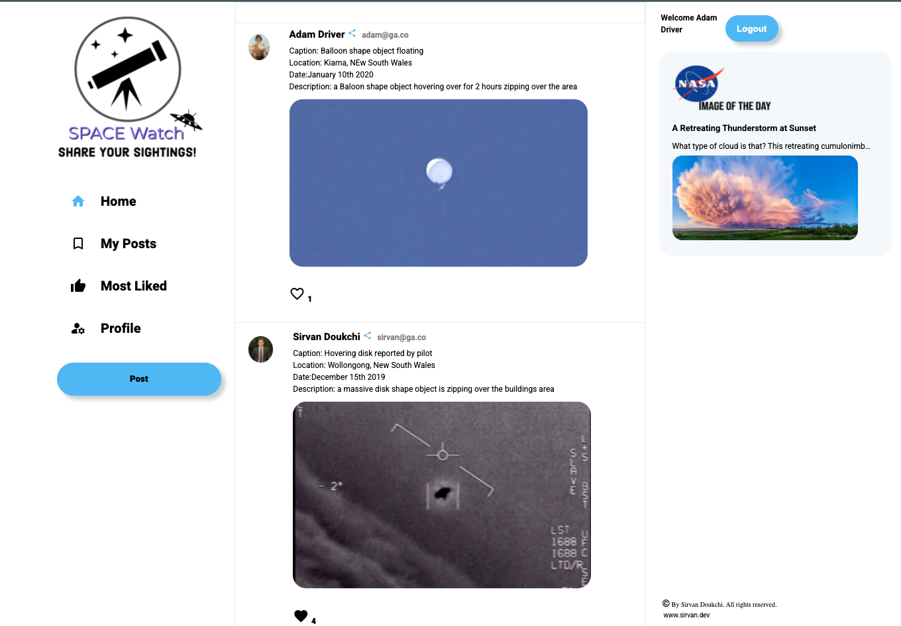

# Space_Watch
## CRUD APP built in Ruby  <a href="https:///"> Live Demo </a>

- Utilising HTML, CSS, PostgreSQL and multiple Ruby gems/frameworks and APIs users can signup/login/authenticate/share/edit/delete space images.
- Inspired by Twitter theme, Space Watch lets users to like posts and then an option to see the most liked posts in descending order. 
- Ruby Gems used: Sinatra,PG,BCrypt,nasa_api
- Cloudinary API has been used for uploading local imgase. API Keys has been kep as an enviromental variable for security.
- BCrypt API has been used to store and digest users password and authenticate users upon login.
- NASA_APOD image of the day API has been used as a widget.
- Material Icons has been used for styling.
- Adobe Express for designing logos
- Deployed on Heroku

### ScreenShot

